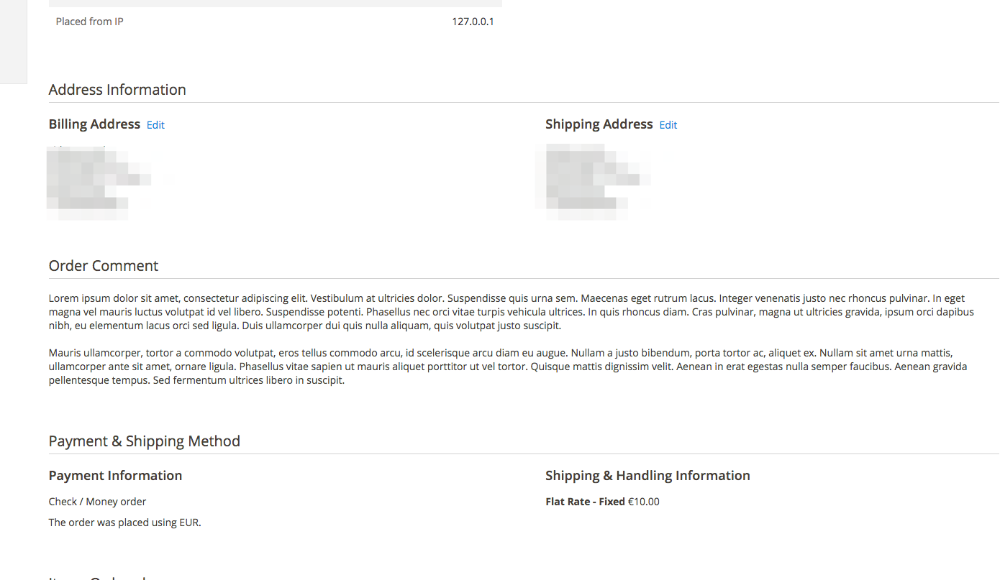

# M2Commerce Commerce: Magento 2 Order Comments

## Description
This extension allows customers to place a comment during the checkout.
The comment field is displayed in the billing step right above the place order button.

Additionally, there is also the option of showing the comment field on the cart page.

Store owners can then see these comments in the backend on the order grid and on the order view page.

## Configuration

There are several configuration options for this extension, which can be found at **STORES > Configuration > Commerce Enterprise > Order Comments**.

### Checkout view


### Admin panel


## Installation
### Magento® Marketplace

This extension will also be available on the Magento® Marketplace when approved.

1. Go to Magento® 2 root folder
2. Require/Download this extension:

   Enter following commands to install extension.

   ```
   composer require m2commerce/order-comment
   ```

   Wait while composer is updated.

   #### OR

   You can also download code from this repo under Magento® 2 following directory:

    ```
    app/code/M2Commerce/OrderComment
    ```    

3. Enter following commands to enable the module:

   ```
   php bin/magento module:enable M2Commerce_OrderComment
   php bin/magento setup:upgrade
   php bin/magento setup:di:compile
   php bin/magento cache:clean
   php bin/magento cache:flush
   ```

4. If Magento® is running in production mode, deploy static content:

   ```
   php bin/magento setup:static-content:deploy
   ```

## Technical
To take in account third party payment extensions using custom implementations of Magento_Checkout/js/action/place-order.js to submit the order, this extension sends
the order comment in a separate request during the validation, before the order is placed. It should therefore work out of
the box.

## Uninstall
If you installed this module through composer, then you can run `php bin/magento module:uninstall M2Commerce_OrderComment` to automatically
remove the code and drop the columns added by this extension.

Alternatively you can manually remove the extension and remove the column `order_comment` from the tables
* quote
* sales_order
* sales_order_grid
